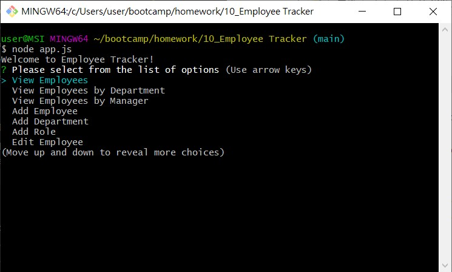

# Employee-Tracker
Goal: To make a CLI app for managing employees 
This project has the following abilites:
- Able to view all employees ordered by *their id/department/reporting manager*
- Able to add new *employee/department/role*
- Able to edit existing *employee/department/role*
- Able to delete existing *employee/department/role*

 

This project contains the following files:
- app.js: Contains logic for the prompts as well as calls to the ORM for SQL queries
- orm.js: Contains all SQL queries for performing tasks mentioned above
- database.sql: Contains SQL code for creating a MySQL database to work with this project as well as some initial entries for it

 

This project was made with **NodeJS**, **inquirer npm package** and **MySQL**

### Notes
- If change(s) is made to *department/role*, it will cascade to *role/employee*
- if *department/role* is deleted, corresponding foreign key, i.e. id, in *role/employee* will set to NULL

## Main Menu
- There are 12 options in total to view/add/edit/delete

## Using the Employee Tracker
- Start the program by: **node app.js** or **npm start**
- Select the action you want to perform from the main menu's list.
- After choosing an action, you will be prompted to enter different info based on what you have selected
- After you have enter all the info, the corresponding list, i.e. *employee/department/role*, will be printed to the console
- Then, you will be prompted for more action or not. If you entered nothing, it will be defaulted to "Yes". Otherwise, please enter "n" or "No"
- Showcase video: https://drive.google.com/file/d/1c3noUuBsvdTLdBxBSRdqN5dphOCOooYO/view?usp=sharing
